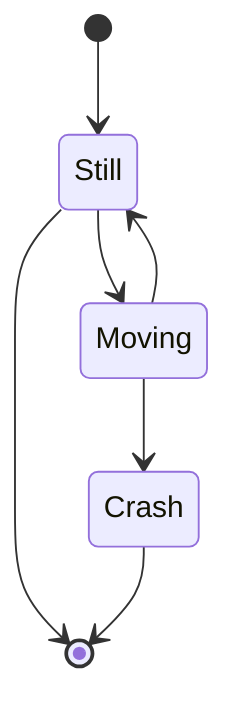
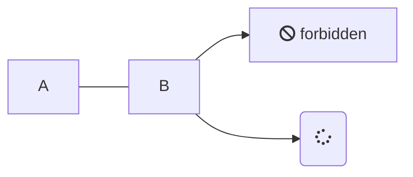
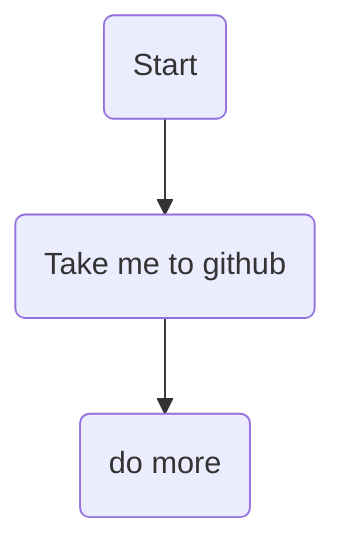
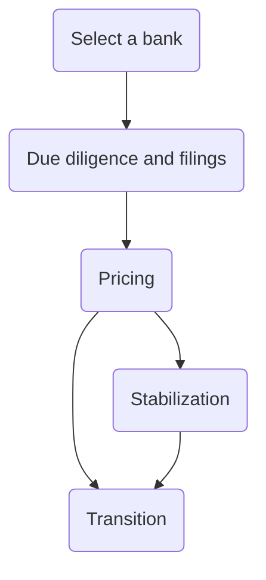
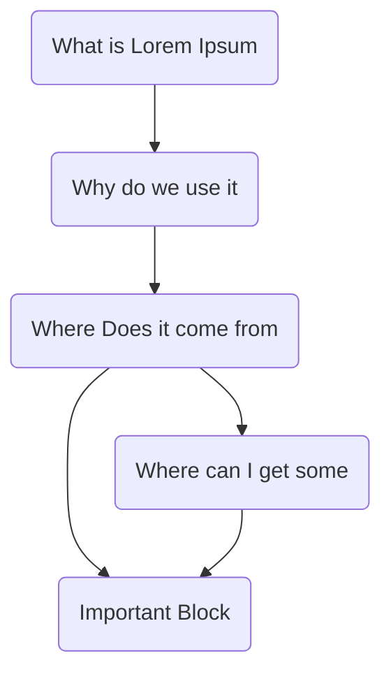

## Lorem Ipsum

##### _"Neque porro quisquam est qui dolorem ipsum quia dolor sit amet, consectetur, adipisci velit..."_

###### "There is no one who loves pain itself, who seeks after it and wants to have it, simply because it is pain..."

### What is Lorem Ipsum?

**Lorem Ipsum** is simply dummy text of the printing and typesetting industry. Lorem Ipsum has been the industry's standard dummy text ever since the 1500s, when an unknown printer took a galley of type and scrambled it to make a type specimen book. It has survived not only five centuries, but also the leap into electronic typesetting, remaining essentially unchanged. It was popularised in the 1960s with the release of Letraset sheets containing Lorem Ipsum passages, and more recently with desktop publishing software like Aldus PageMaker including versions of Lorem Ipsum.

### Why do we use it?

It is a long established fact that a reader will be distracted by the readable content of a page when looking at its layout. The point of using Lorem Ipsum is that it has a more-or-less normal distribution of letters, as opposed to using 'Content here, content here', making it look like readable English. Many desktop publishing packages and web page editors now use Lorem Ipsum as their default model text, and a search for 'lorem ipsum' will uncover many web sites still in their infancy. Various versions have evolved over the years, sometimes by accident, sometimes on purpose (injected humour and the like).

### Where does it come from?

Contrary to popular belief, Lorem Ipsum is not simply random text. It has roots in a piece of classical Latin literature from 45 BC, making it over 2000 years old. Richard McClintock, a Latin professor at Hampden-Sydney College in Virginia, looked up one of the more obscure Latin words, consectetur, from a Lorem Ipsum passage, and going through the cites of the word in classical literature, discovered the undoubtable source. Lorem Ipsum comes from sections 1.10.32 and 1.10.33 of _"de Finibus Bonorum et Malorum"_ (The Extremes of Good and Evil) by Cicero, written in 45 BC. This book is a treatise on the theory of ethics, very popular during the Renaissance. The first line of Lorem Ipsum, "Lorem ipsum dolor sit amet..", comes from a line in section 1.10.32.

The standard chunk of Lorem Ipsum used since the 1500s is reproduced below for those interested. Sections 1.10.32 and 1.10.33 from "de Finibus Bonorum et Malorum" by Cicero are also reproduced in their exact original form, accompanied by English versions from the 1914 translation by H. Rackham.

### Where can I get some?

There are many variations of passages of Lorem Ipsum available, but the majority have suffered alteration in some form, by injected humour, or randomised words which don't look even slightly believable. If you are going to use a passage of Lorem Ipsum, you need to be sure there isn't anything embarrassing hidden in the middle of text. All the Lorem Ipsum generators on the Internet tend to repeat predefined chunks as necessary, making this the first true generator on the Internet.

### Important Block

```md
Name: User
Location : Earth
It uses a dictionary of over 200 Latin words,
```

---

> Lorem ipsum dolor sit amet, consectetur adipiscing elit.

- Aliquam vitae lorem vitae turpis luctus pulvinar vitae vel velit.
- Cras efficitur massa quis ipsum vehicula, et molestie enim tempus.
- Phasellus aliquam risus dictum arcu porta scelerisque.
- Donec vel leo convallis, imperdiet felis in, consequat sapien.
- Integer eu risus at neque consectetur elementum et quis risus.
- Fusce condimentum lorem vel tortor ultricies, sed tempus lectus vulputate.

?> Lorem ipsum dolor sit amet, consectetur adipiscing elit.

1. Phasellus interdum arcu at arcu placerat finibus.
1. Vivamus ac massa in nulla finibus vestibulum.
1. Vestibulum non dolor ac tortor laoreet porta non ut nulla.
1. Sed mattis velit venenatis dui pharetra luctus.
1. Aliquam sed massa elementum, efficitur metus a, feugiat sapien.
1. Praesent mattis odio sed orci venenatis, non sagittis dolor consectetur.
1. Praesent faucibus orci nec maximus euismod.

!> Lorem ipsum dolor sit amet, consectetur adipiscing elit.

- Phasellus interdum arcu at arcu placerat finibus.
- Vivamus ac massa in nulla finibus vestibulum.
- Vestibulum non dolor ac tortor laoreet porta non ut nulla.
- Sed mattis velit venenatis dui pharetra luctus.
- Aliquam sed massa elementum, efficitur metus a, feugiat sapien.
- Praesent mattis odio sed orci venenatis, non sagittis dolor consectetur.

### Image

This is page cover


### Mermaid Support

?> Flow with state diagram





?> Group diagrams



### Overview of the IPO Process

This guide will break down the steps involved in the process, which can take anywhere from six months to over a year to complete.

Below are the steps a company must undertake to go public via an IPO process:

?> Time Line Support _Second one is link_



!> Internal Routing example


